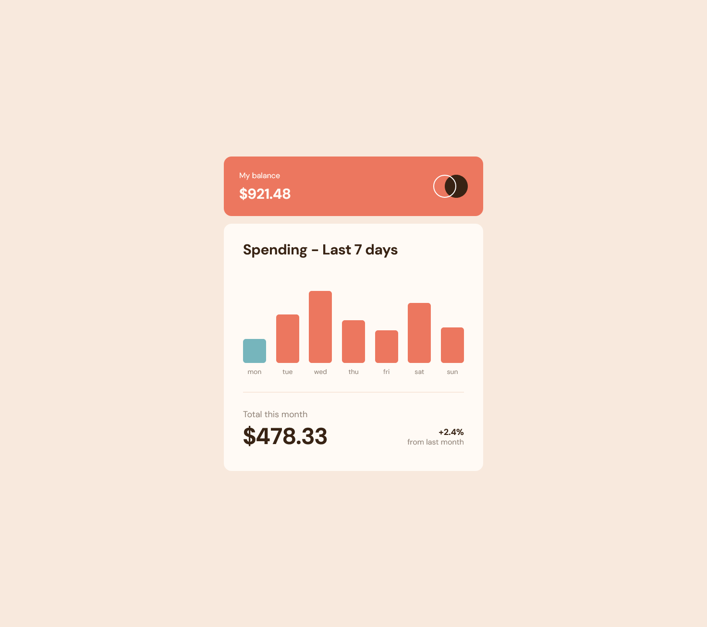

# Frontend Mentor - Expenses chart component solution

This is a solution to the [Expenses chart component challenge on Frontend Mentor](https://www.frontendmentor.io/challenges/expenses-chart-component-e7yJBUdjwt). Frontend Mentor challenges help you improve your coding skills by building realistic projects.

## Table of contents

- [Overview](#overview)
  - [The challenge](#the-challenge)
  - [Screenshot](#screenshot)
  - [Links](#links)
- [My process](#my-process)
  - [Built with](#built-with)
  - [What I learned](#what-i-learned)
  - [Useful resources](#useful-resources)
- [Author](#author)

## Overview

### The challenge

Users should be able to:

- View the bar chart and hover over the individual bars to see the correct amounts for each day
- See the current day’s bar highlighted in a different colour to the other bars
- View the optimal layout for the content depending on their device’s screen size
- See hover states for all interactive elements on the page
- **Bonus**: Use the JSON data file provided to dynamically size the bars on the chart

### Screenshot



### Links

- Solution URL: [Repository Link](https://github.com/mjclaypool/Expenses-Chart-Component)
- Live Site URL: [Live Link](https://mjclaypool.github.io/Expenses-Chart-Component/)

## My process

### Built with

- Semantic HTML5 markup
- Flexbox
- Mobile-first workflow
- [React](https://reactjs.org/) - JS library
- [Tailwind CSS](https://tailwindcss.com/) - For styles

### What I learned

I learned how to use group-hover in Tailwind CSS to style child elements when hovering on their parent. This allowed me to display the daily amount spent when the user hovers on a specific day.

```html
<div className="group relative bg-primary-soft-red w-8 lg:w-12 rounded-sm lg:rounded-md cursor-pointer hover:bg-opacity-70" style={{height: barElements[day.day]}}>
  <div className="invisible group-hover:visible absolute -top-12 left-[50%] translate-x-[-50%] bg-neutral-dark-brown rounded-sm lg:rounded-md">
    <p className="font-bold text-center text-neutral-pale-orange p-2">${day.amount}</p>
  </div>
</div>
```

### Useful resources

- [Tailwind CSS Documentation](https://tailwindcss.com/docs/installation) - This well-documented reference website helped me efficiently transition from vanilla CSS to Tailwind CSS. It is a popular CSS framework that promotes increased efficiency in styling applications.

## Author

- Website - [Mallory Claypool](https://mjclaypool.github.io/Personal-Portfolio/)
- Frontend Mentor - [@mjclaypool](https://www.frontendmentor.io/profile/mjclaypool)